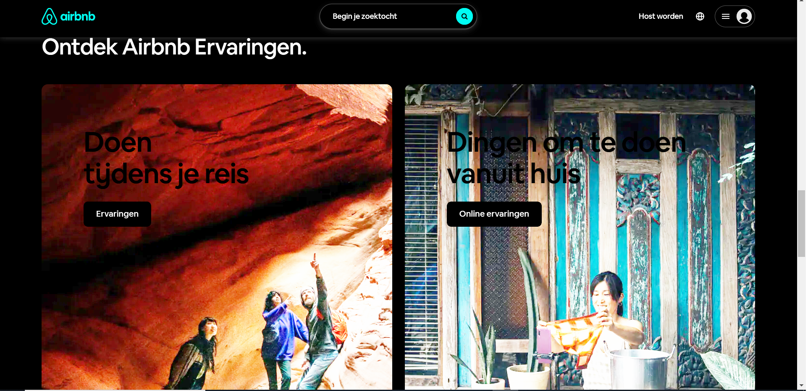

# Opdracht 1:
https://dustinschouten.github.io/browser-technologies-2122/

# Opdracht 2:

Onderzochte website: https://www.airbnb.nl/

Onderzoek naar:

## Kleur uitzetten & kleurenblindheid instellen

### Hoe zet je deze feature uit op Google Chrome?
Ga naar deze website: https://chrome.google.com/webstore/detail/high-contrast/djcfdncoelnlbldjfhinnjlhdjlikmph?hl=nl
Klik op 'Toev. aan Chrome' en vervolgens op 'Extensie toevoegen'.
Vervolgens kun je kiezen om de extensie in of uit te schakelen. Als je deze inschakelt, krijg je een aantal opties, zoals 'normaal', 'grijstinten' en 'omgekeerde kleur'.

### Ervaringen
Hieronder heb ik screenshots van de website gemaakt.

Naar mijn mening is er bij het ontwikkelen van de website van Airbnb goed gelet op kleurenblindheid. 

Er is veel gebruikgemaakt van zwarte teksten op witte achtergronden en witte teksten op donkere achtergronden waarvan het contrast hoog genoeg is. Wanneer je de website in grijstinten bekijkt, zijn er geen problemen met het lezen van de teksten en het bekijken van de afbeeldingen.

Ook bevat deze website inlogformulieren waarbij er, naast het gebruik van een rode kleur, ook in tekst wordt aangegeven dat de gebruiker niet correct is ingelogd.

Wat verder goed aan deze website is, is dat de meeste teksten zwart/wit zijn en dat er slechts een aantal belangrijke features een andere kleur hebben. Denk hierbij aan knoppen om te kunnen zoeken en de reserveerknop. Wanneer de website in dit geval in negatieve kleuren wordt bekeken, komen deze knoppen visueel extra naar voren.

Het enige minpuntje aan deze website is dat bij het instellen van negatieve kleuren de witte letters en knoppen op de relatief donkere afbeeldingen zwart worden. Dit maakt het minder leesbaar. Zie de screenshot hieronder:

## Breedband internet uitzetten
### Hoe zet je deze feature uit op Google Chrome?
Ga naar de pagina inspector (ctrl-shift-i), klik op '>>' en vervolgens op 'Netwerk'. Er opent een scherm waarin je kan zien welke bestanden er allemaal van de server naar de browser geladen zijn, hoe snel deze geladen zijn en of het laden succesvol was of niet.
Klik vervolgens op 'Geen throttling'. Je krijgt een aantal opties te zien waarbij je een ander netwerk zoals 'snelle 3G', 'langzame 3G' en 'offline' kan selecteren.

Zie de screenshot hieronder:

### Ervaringen
Naar mijn mening is er bij het ontwikkelen van de website van Airbnb bij vlagen voldoende rekening gehouden met de performance van de website. 

Ik heb de optie 'langzame 3G' uitgeprobeerd en ik heb gemerkt dat het meer dan 40 seconden duurt om 2MB aan data op te halen. Dit duurt ongeveer 5 seconden wanneer de optie 'Geen throttling' (normale internetsnelheid) wordt geselecteerd. Dit kan worden gecontroleerd in de pagina inspector. Dit betekent dat het relatief lang duurt om content op de website te laden. Dit verschil merk je voornamelijk bij het inladen van plaatjes. Je merkt dat je soms 3 of 4 seconden moet wachten voordat een nieuwe pagina geladen is. Desondanks is de website relatief snel geladen en lijkt het met onwaarschijnlijk dat je als gebruiker al te veel last ondervindt van een trage website. 
